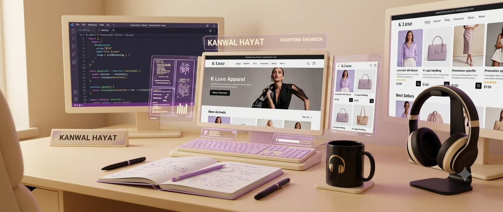

  

  

 

🌐💜 **“Designing the Web with Creativity, AI & Lavender Glow.”** ⚡ *I create modern, aesthetic & animated UI/UX with AI power.* ⚡  

---

## 🌸 About Me
- 🌱 Currently mastering **Frontend Engineering & AI Automation**
- ⚙️ Tech Stack: **HTML | CSS | JavaScript | React.js | Tailwind CSS | Figma | Git | GitHub | Canva| AI Prompt Engineering**
- 💎 Passion: *Animated UI, Clean Layouts & AI Integration*
- 💌 Email: **kanwalziait@gmail.com**
- 😄 Fun Fact: *I don’t find bugs… bugs find me 😆*

---

## 🔗 Connect With Me

  
  
  

---

## 🛠️ Tools & Technologies

  

---

## ⚡ GitHub Stats 

  
  

---

## 🌊 Contribution Flow 

  

---

## 💬 Quote of the Day
> 🌟 **“Code is not just logic — it’s art in motion.”** > — *Kanwal Hayat*

---

✨💜 *Thanks for visiting — Drop a ⭐ to support!* 💜✨  
 

